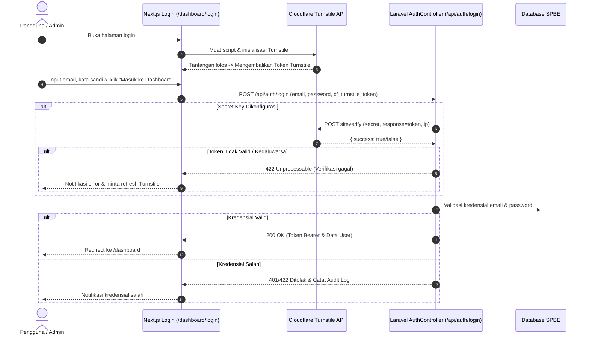

# Panduan Integrasi Cloudflare Turnstile Verification — Portal Admin BAPPEDA HALUT

Dokumen ini menjelaskan arsitektur, konfigurasi, dan langkah-langkah setup Cloudflare Turnstile pada Portal Admin BAPPEDA Kab. Halmahera Utara.

---

## 1. Ikhtisar (Overview)

Cloudflare Turnstile adalah solusi CAPTCHA modern non-intrusif dan ramah privasi yang menggantikan CAPTCHA tradisional (seperti reCAPTCHA puzzle). Turnstile memverifikasi pengguna secara cerdas dalam hitungan milidetik tanpa memaksa pengguna memilih gambar lampu lalu lintas atau motor.

Pada sistem SPBE BAPPEDA Halut:
- **Frontend**: Komponen kustom `CloudflareTurnstile` dimuat pada halaman login admin (`/dashboard/login`).
- **Backend**: Endpoint `POST /api/auth/login` memvalidasi token Turnstile ke server Cloudflare (`https://challenges.cloudflare.com/turnstile/v0/siteverify`).

---

## 2. Langkah-Langkah Mendapatkan Kunci Turnstile (Cloudflare Dashboard)

Ikuti langkah praktis berikut untuk mengaktifkan Turnstile di Cloudflare:

### Langkah 1: Masuk ke Cloudflare Dashboard
1. Buka [dash.cloudflare.com](https://dash.cloudflare.com/).
2. Login atau daftar akun Cloudflare (bisa menggunakan akun gratis).

### Langkah 2: Buat Widget Turnstile
1. Pada menu navigasi sebelah kiri, klik menu **Turnstile**.
2. Klik tombol **Add site** (atau **Create Widget**).
3. Isi formulir pembuatan widget:
   - **Site name**: `Portal Admin BAPPEDA HALUT` (atau nama lain yang mudah dikenali).
   - **Domain**:
     - Masukkan domain resmi: `bappeda.halmaherautarakab.go.id` (atau domain server Anda).
     - Untuk pengujian lokal/staging, Anda juga dapat menambahkan: `localhost`, `127.0.0.1`.
   - **Widget Mode**:
     - Pilih **Managed** (Sangat disarankan: Cloudflare otomatis menentukan kapan perlu tantangan interaktif berdasarkan level risiko bot).
     - Atau pilih **Non-interactive** (hanya berupa checkbox otomatis transparan tanpa puzzle).
4. Klik tombol **Create**.

### Langkah 3: Ambil Site Key & Secret Key
Setelah widget berhasil dibuat, Anda akan mendapatkan 2 kunci:
1. **Site Key** (Public): Digunakan di sisi frontend Next.js.
2. **Secret Key** (Private): Digunakan di sisi backend Laravel (JANGAN pernah bagikan atau expose ke frontend).

---

## 3. Konfigurasi Environment (`.env`)

### Sisi Backend (Laravel)
Tambahkan variabel berikut ke file `.env` di direktori `backend/`:

```env
# Cloudflare Turnstile Production
CLOUDFLARE_TURNSTILE_SITE_KEY=0x4AAAAAA... (Site Key dari dashboard)
CLOUDFLARE_TURNSTILE_SECRET_KEY=0x4AAAAAA... (Secret Key dari dashboard)
```

> **Catatan Pengembangan Lokal (Development & Testing)**:  
> Cloudflare menyediakan Dummy Keys resmi yang selalu lolos (*Always Pass*) tanpa perlu akun:
> - Site Key: `1x00000000000000000000AA`
> - Secret Key: `1x0000000000000000000000000000000AA`
> 
> Jika `CLOUDFLARE_TURNSTILE_SECRET_KEY` dikosongkan di backend, backend secara aman mengabaikan verifikasi Turnstile sehingga developer lokal tetap dapat login.

### Sisi Frontend (Next.js)
Tambahkan variabel berikut ke file `.env.local` atau environment production di direktori `frontend/`:

```env
# Cloudflare Turnstile Site Key
NEXT_PUBLIC_CLOUDFLARE_TURNSTILE_SITE_KEY=0x4AAAAAA... (Site Key Anda)
```

---

## 4. Alur Kerja Autentikasi (Authentication Flow)



---

## 5. Komponen & Berkas Terkait

1. **Frontend Component**:
   - `frontend/src/components/ui/CloudflareTurnstile.tsx`: Komponen wrapper React murni dengan auto-inject script, event reset, status visual, dan integrasi Tailwind CSS.
   - `frontend/src/app/dashboard/login/page.tsx`: Halaman login yang memuat widget Turnstile sebelum tombol submit.
   - `frontend/src/context/AuthContext.tsx`: Fungsi `login(email, password, cfTurnstileToken)` mengirimkan token ke backend.

2. **Backend Controller**:
   - `backend/app/Http/Controllers/Api/AuthController.php`: Verifikasi token via `Http::asForm()->post('https://challenges.cloudflare.com/turnstile/v0/siteverify')`.
   - `backend/config/services.php`: Konfigurasi `services.cloudflare.turnstile_secret` dan `services.cloudflare.turnstile_site_key`.

---

## 6. Verifikasi & Pengujian

- **Pengujian Sukses**: Isi form email dan password, tunggu ikon checklist hijau ("Terverifikasi"), klik "Masuk ke Dashboard".
- **Pengujian Token Kosong / Salah**: Jika token tidak dikirim saat backend mengaktifkan secret key, sistem mengembalikan respon `422: Verifikasi keamanan Cloudflare Turnstile wajib diselesaikan.`
